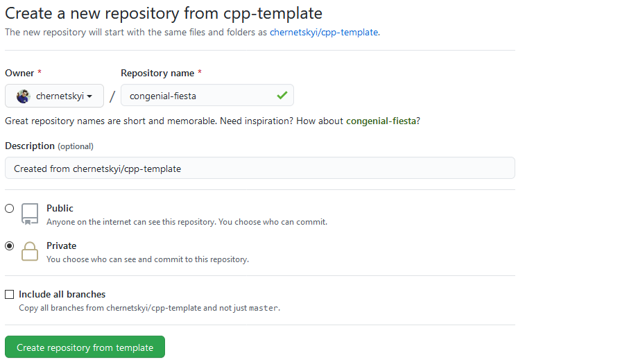
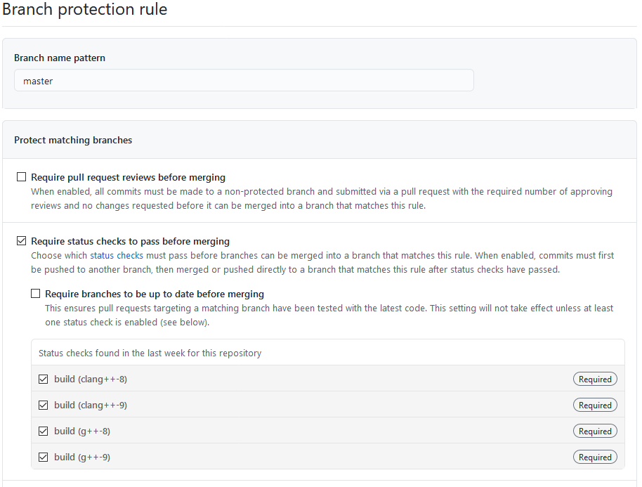
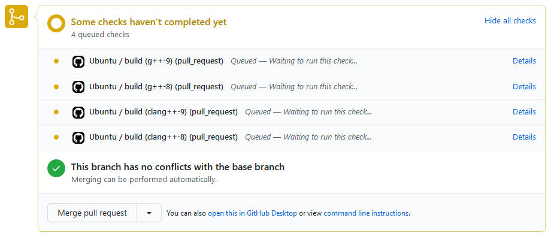

# Інструкції по використанню шаблону C++ проектів для студентів пана Олега Фаренюка

## TL;DR

1. [Згенерувати](https://github.com/chernetskyi/cpp-template/generate) репозиторій з шаблону
2. Склонувати собі свій репозиторій
3. Створити гілку для розробки і попрацювати над своїм проектом в ній
4. Коли нова ітерація проекту готова до релізу - зробити Pull Request в гілку `master`
5. Якщо всі тести успішно пройдено - злити гілки

## Для тих, хто хоче розуміти, що і чому робить

- [Генеруємо репозиторій](#генеруємо-репозиторій)
  - [Приватний чи публічний?](#приватний-чи-публічний)
- [Робота над проектом](#робота-над-проектом)
  - [Один розробник](#один-розробник)
  - [Команда розробників](#команда-розробників)
  - [Рекомендовано: правила захисту гілок](#рекомендовано-правила-захисту-гілок)
- [Про шаблон](#про-шаблон)
  - [README.md](#readmemd)
  - [gitignore](#gitignore)
  - [CMakeLists.txt](#cmakeliststxt)
  - [requirements.txt](#requirementstxt)
  - [ubuntu.yml](#ubuntuyml)

### Генеруємо репозиторій

Заходимо на [сторінку свого улюбленого асистента](https://github.com/chernetskyi) і починаємо стежити, щоб не пропустити жодних оновлень. Переходимо на [сторінку шаблонного репозиторію](https://github.com/chernetskyi/cpp-template) і ставимо зірочку, щоб було легше знайти в майбутньому. [Генеруємо репозиторій](https://github.com/chernetskyi/cpp-template/generate) для свого проекту. Копіювати інші гілки, окрім `master`, немає потреби.



#### Приватний чи публічний?

Для боротьби з плагіатом репозиторій на час розробки проекту потрібно робити приватним. Видимість GitHub репозиторію (публічний/приватний) можна змінити в налаштуваннях репозиторію.

[Неперервна інтеграція](https://uk.wikipedia.org/wiki/Неперервна_інтеграція) в шаблоні базується на [GitHub Actions](https://github.com/features/actions). Для приватних репозиторіїв є обмеження на тривалість роботи GitHub Actions: 2000 хвилин в місяць для безкоштовних акаунтів, 3000 - для PRO. Якщо користуватись GitHub Actions лише для проектів на курсах пана Олега і працювати **розумно** - цих хвилин вистачає. Для публічних репозиторіїв обмежень на тривалість роботи GitHub Actions немає.

### Робота над проектом

Для того, щоб слово **Git** в резюме студентів щось означало, і для того, щоб студенти мали уявлення про процес розробки програмного забезпечення в дорослому світі, працювати з проектом потрібно по одному із "потоків": [Git Flow](https://nvie.com/posts/a-successful-git-branching-model/) або [GitHub Flow](https://guides.github.com/introduction/flow/), наприклад. Пишіть [хороші](https://chris.beams.io/posts/git-commit/) повідомлення комітів, або хоча б без всіляких непристойностей: балів не зніматимемо, але асистентам і викладацькому складу буде весело.

#### Один розробник

1. Клонуємо репозиторій.
2. Створюємо гілку розробки (`dev`/`develop`/`development`, але не `developer`) із гілки `master`: `git checkout -b development`.
3. Вносимо зміни.
4. Зберігаємо зміни віддалено, в `origin`: з `development` гілки `git push -u origin development`(після першого разу можна просто `git push`).
5. Коли, на думку студента, новий реліз проекту є готовим (локально відтестований), - створюємо Pull Request із гілки `development` в гілку `master`.
6. В разі успішного проходження всіх тестів - зливаємо гілки, в іншому разі - виправляємо, тести запускатимуться щоразу при push'і в гілку розробки, поки Pull Request відкритий.

"По книжці", в будь-який момент часу код гілки `master` повинен бути **робочим** - хоча б компільованим. Робота перевірятиметься із гілки `master`.

#### Команда розробників

1. Створюємо гілку розробки (`dev`/`develop`/`development`, але не `developer`) із гілки `master` у Web інтерфейсі GitHub на сторінці репозиторію, щоб уникнути зайвих конфліктів.
2. Клонуємо репозиторій.
3. Щоб розробка над проектом велась командою паралельно, а не послідовно, кожен член команди повинен створювати свою гілку (`feature/help-flag` чи `bug/nullptr-reference` для прикладу) з останньої версії гілки розробки: `git pull`, `git checkout development`, `git checkout -b feature/common-library`.
4. Вносимо зміни.
5. Зберігаємо зміни віддалено, в `origin`: з своєї гілки `git push -u origin feature/common-library`(після першого разу можна просто `git push`).
6. Коли, на думку студента, частина функціоналу, яку він реалізовував чи виправляв готова (локально відтестована), - створюємо Pull Request із своєї гілки в гілку розробки і зливаємо гілки.
7. Коли, на думку команди, новий реліз проекту є готовим (локально відтестований), - створюємо Pull Request із гілки `development` в гілку `master`.
8. В разі успішного проходження всіх тестів - зливаємо гілки, в іншому разі - виправляємо, тести запускатимуться щоразу при push'і в гілку розробки, поки Pull Request відкритий.

"По книжці", в будь-який момент часу код гілки `master` повинен бути **робочим** - хоча б компільованим. Робота перевірятиметься із гілки `master`.

#### Рекомендовано: правила захисту гілок

Для "правильності", після першого Pull Request, налаштуємо правила захисту гілок. З їх допомогю можна заборонити злиття гілок, якщо не проходять тести. В налаштуваннях репозиторію, в розділі **Branches**, створюємо нове правило.



### Про шаблон

Проект - лише для прикладу, щоб показати структуру.

#### README.md

[README.md](https://github.com/chernetskyi/cpp-template/blob/master/README.md) є прикладом того, що від вас хоче бачити той, хто перевіряє. Допускаються README в довільному вигляді, проте на питання "як компілювати?", "як користуватись?", та "хто робив?" варто відповісти.

#### gitignore

[.gitignore](https://github.com/chernetskyi/cpp-template/blob/master/.gitignore) включає в себе велику кількість правил, щоб студенти не завантажували "сміття": артефакти компіляції, файли налаштування проекту в середовищі розробки та інше.

#### CMakeLists.txt

[CMakeLists.txt](https://github.com/chernetskyi/cpp-template/blob/master/CMakeLists.txt) включає два рекомендованих до використання правила.

```cmake
if (PROJECT_SOURCE_DIR STREQUAL PROJECT_BINARY_DIR)
    message(FATAL_ERROR "In-source builds not allowed. Make a build directory and run CMake from there.\n")
endif ()
```

Забороняє запуск CMake в директорії з source файлами.

```cmake
if(NOT CMAKE_BUILD_TYPE)
    set(CMAKE_BUILD_TYPE Release)
endif()
```

Компілює реліз версію проекту, якщо не вказано іншого.

#### requirements.txt

В [requirements.txt](https://github.com/chernetskyi/cpp-template/blob/master/requirements.txt) потрібно вказувати назви пакетів пакетного менеджеру GNU/Linux дистрибутиву Ubuntu, які необхідні для успішної компіляції вашого проекту, розділені новим рядком. Файл підтримує коментарі, тому пишіть їх.

> Зазвичай, якщо ви використовуєте CMake директиву `find_package()`, то потрібно додати запис в requirements.txt.

Навіть якщо ви не потребуєте жодних додаткових пакетів, **не видаляйте requirements.txt**, залиште його порожнім.  Навіть якщо ваш пакет є в середовищі GitHub Action ([cписок](https://github.com/actions/virtual-environments/blob/main/images/linux/Ubuntu2004-README.md)), вкажіть його в requirements.txt, його може не бути в того, хто перевіряє.

Не забудьте прибрати Boost.Program_options із requirements.txt, якщо не потребуєте його, - це прискорить тести.

#### ubuntu.yml

[ubuntu.yml](https://github.com/chernetskyi/cpp-template/blob/master/.github/workflows/ubuntu.yml) описує запуск GitHub Actions для неперервної інтеграції. На даний момент, тестується лише компільованість проекту на компіляторах g++ та clang++ 8-ої та 9-ої версій (4 тести). Тести запускаються паралельно.



## Зворотній зв'язок

Будь-які коментарі по шаблону пишіть автору ([вашому улюбленому асистенту](https://github.com/chernetskyi)) особисто. Пропозиції по реалізації нового функціоналу чи bug report'и залишайте в [issues](https://github.com/chernetskyi/cpp-template/issues).
